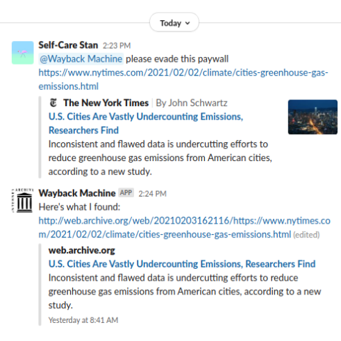

# Slack Wayback bot

This code is for deploying a Slack bot that responds to app mentions with the latest [web.archive.org](http://web.archive.org/) archived copy of any links in the user's message.
The code is written to run on AWS Lambda.

## Requirements

To deploy this bot, you'll need access to a Slack space where you have permissions to install new apps, and you'll also need an AWS account.

## Slack configuration

The Slack app has the following features and functionality:
* **Event Subscriptions** (registered using the provided AWS Lambda URL endpoint)
* **Bots**
* **Permissions** (This is where you'll find your bot token which you'll want to configure as an environment variable named `SLACK_BOT_TOKEN`. This is the token that starts with `xoxb-*`.)

Currently, the configured Slack Bot Token Scopes are:
* `app_mentions:read`
* `channels:join`
* `chat:write`
* `chat:write.public`
* `links:read`

The bot is also subscribed to the `app_mention` Event Name.
It is not subscribed to any events on behalf of users.

## Example Display Information

App name  | Short description |
---   | --- |
Wayback Machine   | If you @ me, I'll post the most recent archived copies of the links in your message. Use me to get around news paywalls! |

## Related tutorials

If you're interested in setting up a similar Slack bot, I recommend starting with the [Slack API Bot tutorial](https://api.slack.com/bot-users).

Once you're ready to deploy, I recommend [this Medium post for configuring Slack bots on AWS Lambda](https://medium.com/glasswall-engineering/how-to-create-a-slack-bot-using-aws-lambda-in-1-hour-1dbc1b6f021c).
